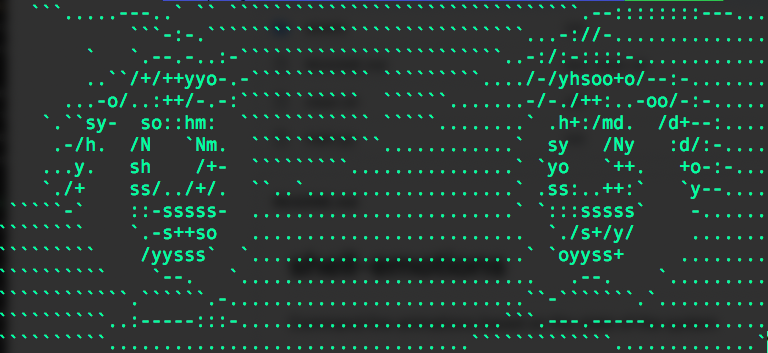

# shell-emotions
Command line animations based on the state of the system

## Workflow for getting the ascii frames

- Use https://ezgif.com/split to split desired gif animation into frames

- Use https://www.text-image.com/convert/ to create ascii frames based on previously created image frames

- Locate the images and ascii frames in assets directory

### clean.sh

Use clean.sh file for cleaning undesired characters from the ascii frames