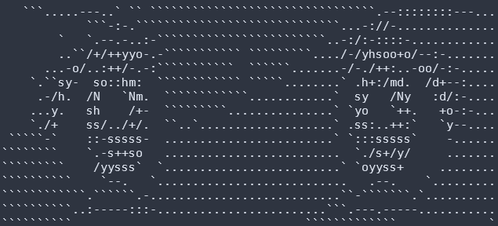

# shell-emotions
Command line animations based on the state of the system for Linux or Windows 10



## Workflow for getting the ascii frames

- Use https://ezgif.com/split to split desired gif animation into frames

- Use https://www.text-image.com/convert/ to create ascii frames based on previously created image frames

- Locate the images and ascii frames in assets directory

## Adding Animations

 - Create ascii frames using above workflow or modified Termimium from https://github.com/avanishsubbiah/termimation-save-frames
 - Move ascii frames named 0-N to `./assets/frames/<insert_emotion_name>`
 - Add `<insert_emotion_name>` to `emotions_names` in `main.py`

## Requirements

 - Python 2 or 3
 - psutil
 - Bash, Fish, or Powershell

## clean.sh

Use clean.sh file for cleaning undesired characters from the ascii frames

## main.py

### Functions

```
state_update(thread_name):
```

The state update thread is a daemon that queries system stats through psutil and updates `global state`.

```
emote(thread_name):
```

The emote thread is a daemon that runs the correct animation based on `state` continuously.

```
shutdown(signum, frame):
```

The shutdown function handles clean shutdown of the program with "Shutting down..." printout.

```
main():
```

The main function deals with signal handling and starts both state update and emote threads.

### Classes

```
class Animation:
```

The `Animation` class has the properties `name`, `id`, `file_path`, and `frames`. 
It will fill `frames` list upon initialization using input `file_path` and `name`.